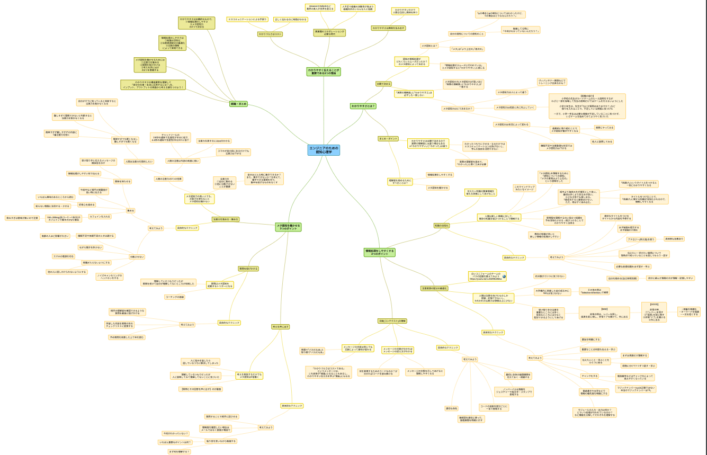

## わかりやすく伝えることが重要である3つの理由
1. わかりづらさは「コスト」  
	ミスコミュニケーションによる手戻り(指示と全然違う成果物を持ってきたというケース)
	(手戻りが発生しなくとも)正しく伝わるのに時間がかかる
2. 異業種とのコラボレーションが必要な時代  
	AmazonやAirbnbなど、業界の素人が世界を変える(業界が複雑に絡まり合っている)  
	人不足で組織の流動性が高まり、組織内のいろんな人と強調することが求められる
3. わかりやすさは興味を生み出す  
	わかりやすいだけで人間は注目し興味を持つ  
  興味をも持たせる力のある人は、影響力のある人

↓マインドマップ(人間の理解の構造に近い形で情報を整理すると、情報を理解・記憶しやすくなったり、アイデアが浮かびやすくなる)

